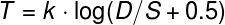

# Lei de Fitts

Proposto por Paul Fitts em 1954.

Relaciona o tempo em que uma pessoa leva para aponta para algo levando em consideração o tamanho do objeto e a distância que ele se encontra do agente que aponta.

* T = tempo para apontar
* k = constante empiricamente definida
* D = distância até o objeto
* S = tamanho do objeto alvo
