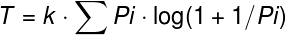

# Lei de Hick-Hyman

Proposto por William Edmund Hick e Ray Hyman entre 1952 e 1953.

Relaciona o tempo em que uma pessoa leva para tomar uma decisão com a quantidade de escolhas que ela possui.

Quanto maior a quantidade de escolhas, maior o tempo para se tomar uma decisão.

## Probabilidades iguais

* T = tempo médio para tomada de decisão
* k = constante definida empiricamente
* N = quantidade de opções disponíveis para escolha

A adição de 1 ao N indica a incerteza de se não escolher nenhuma das alternativas.

## Probabilidades diferentes

* T = tempo médio para tomada de decisão
* k = constante definida empiricamente
* Pi = probabilidade de escolha
