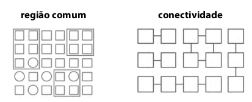

# Princípios de Gestalt

É um conjunto de leis de percepção de padrões.

> A inteligência humana é caracterizada pela capacidade de identificar padrões. \(WERE, 2003\)

## Proximidade

Entidades visuais próximas umas das outras são percebidas como um grupo.

## Boa continuidade

Traços contínuos são percebidos mais prontamente do que contornos que mudam de direção rapidamente.

## Simetria

Objetos simétricos são mais prontamente percebidos do que objetos assimétricos.

## Similaridade

Objetos semelhantes são percebidos como um grupo.

## Destino comum

Objetos com a mesma direção de movimento são percebidos como um grupo.

## Fecho

Complemento de falhas e aumento de regularidade.

## Região comum

Objetos dentro de uma região espacial confinada são percebidos como um grupo.

## Conectividade

Objetos conectados por traços contínuos são percebidos como relacionados.

