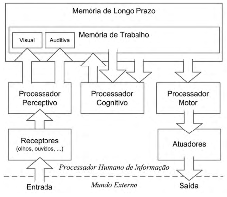

# Processador Humano de Informação

Proposto por Card, Moran e Newell em 1983.

> \[...\] modelos que veem o ser humano como um processador de informações fornece um arcabouço comum nos quais modelos de memória, de resolução de problemas, de percepção e de comportamento podem ser integrados uns com os outros \(BARBOSA, 2011\).

> Considerando a mente humana como um sistema de processamento de informações, é possível fazer predições aproximadas de parte do comportamento humano \(BARBOSA, 2011\).

É composto por 3 subsistemas:

* Perceptivo
* Motor
* Cognitivo

