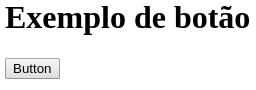
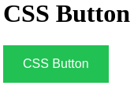
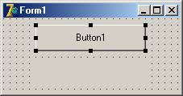
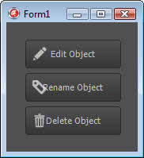
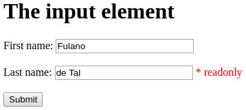

# Affordance

## Conceitos

> É o conjunto de características do hardware e softare, perceptíveis pelo usuário que apontam para as operações que podem ser realizadas com o sistema interativo. \(A PRINCÍPIO\)

> Corresponde ao conjunto de características de um objeto capazes de revelar ao usuário as operações e manipulações que eles recebem. \(NORMAN, 1988\)

> As características físicas de um artefato evidenciam o que é possível fazer com ele e as maneiras de utilizá-lo \(BARBOSA, 2011\)

> O conjunto de características do hardware e do software perceptíveis pelo usuário aponta para um conjunto de operações que podem ser realizadas com o sistema interativo, bem como para as formas de realizá-las manipulando os elementos da interface \(BARBOSA, 2011\)

### Exemplos

#### Bons

Em um botão o _affordance_ diz respeito a pressioná-lo e esperar alguma ação executada.

#### Ruins

Em uma mensagem apresentada em um campo de texto, espera-se que ela possa ser editada e enviada ao sistema, que não acontece.

Falsos _affordances_ devem ser evitadas pois trazem inconveniências à interação com o usuário.

