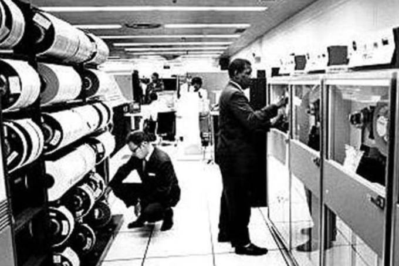
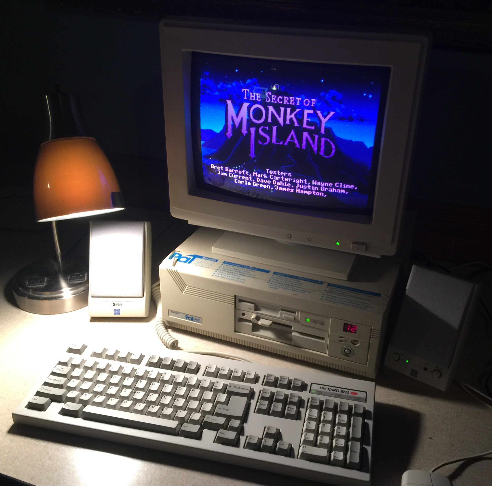
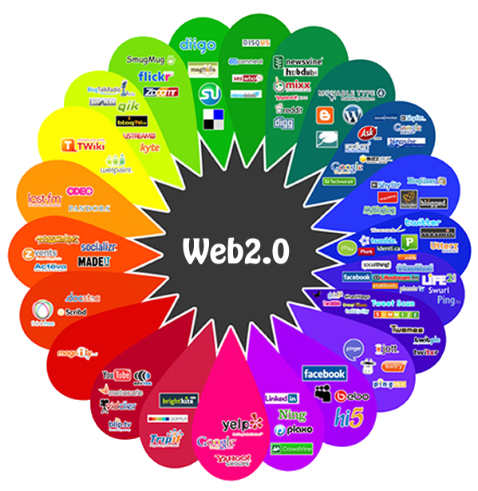
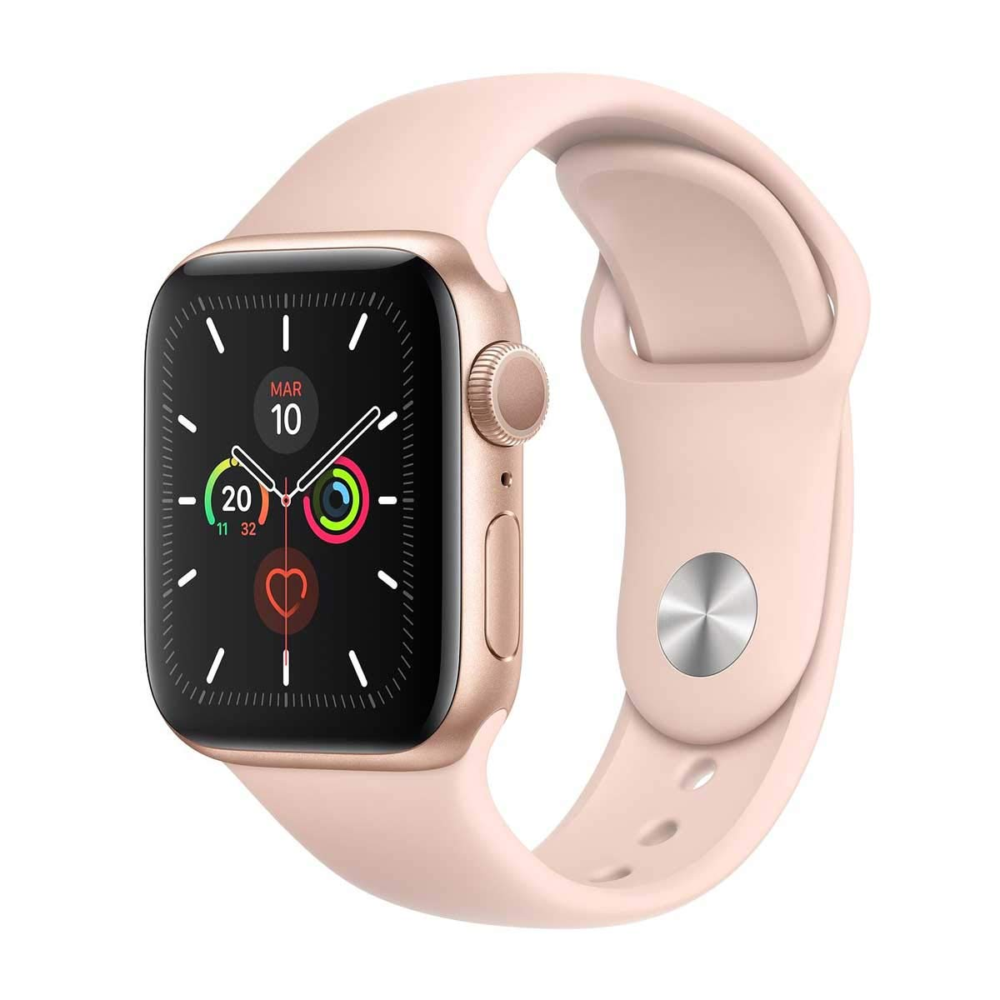
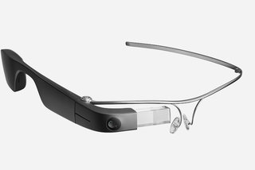
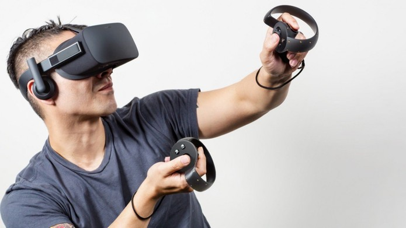

# Introdução

> Processo pelo qual seres humanos interagem com computadores.

> Modos, meios e processos envolvidos no uso de tecnologias de informação e comunicação \(TIC\).

## Tecnologia da Informação e Comunicação

> São sistemas computacionais compostos por hardware, software e meios de comunicação.

> \[...\] desenvolvidos para interagir com pessoas.

### Evolução da TIC

#### Década de 80 \(mainframes\)

#### Década de 90 \(computadores pessoais\)

#### Década de 2000 \(Web 2.0\)

#### Década de 2010 \(Dispositivos "inteligentes" vestíveis, realidade virtual e aumentada\)

## Impacto

Frente a evolução da TIC, ela passa a fazer parte do cotidiano das mais básicas atividades até as mais complexas.

Computadores pessoais passaram a caber dentro do bolso.

Entretenimento \(filmes, games, etc\) passam a se beneficiar ativamente da TIC.

Programas de TV e rádio passaram a aumentar seu impacto frente aos consumidores com apoio da TIC.

Consoles \(vídeo-game\) passam a estar constantemente conectados a internet permitindo interações entre jogadores geograficamente separados.

TVDI \(TV Digital Interativa\) é uma promessa que luta para encontrar uma forma de interação que traga benefícios ao usuário, mas as possibilidades são incríveis.

O Estado \(Governo Federal, estadual e municipal\) passam a oferecer serviços digitais aumentando sua eficiência.

A Urna Eletrônica revolucionou a forma de votar no Brasil, permitindo aferir o resultado no mesmo dia da votação.

## Multidisciplinaridade

Necessidade de envolver profissionais de diversas áreas de conhecimento para melhor atender ao usuário final.

> IHC se beneficia de conhecimentos e métodos de outras áreas fora da Computação para conhecer melhor os fenômenos envolvidos no uso de sistemas computacionais interativos.

* Psicologia
* Sociologia
* Antropologia

##  Benefícios

Aumentar a qualidade da interação entre o ser humano e o sistema interativo.

* Aumento da produtividade do usuário.
* Reduzir o número e a gravidade de erros cometidos pelo usuário.
* Reduzir o custo de treinamento do usuário ao sistema.
* Reduzir o custo do suporte técnico ao sistema.
* Aumentar a fidelidade do usuário ao sistema.

## Exercícios

1. O impacto das TICs no cotidiano dos usuários. Como a TIC está inserida no cotidiano? Escolha uma atividade que você realiza no cotidiano e identifique os pontos de interação com a TIC.
   1. Acender a luz.
   2. Abrir a torneira para pegar água.
   3. Aguardar o semáforo abrir.
2. Compare o pagamento de contas \(boletos, água, luz, etc.\) de uma pessoa que possui aplicativo no telefone a uma que não possui.

