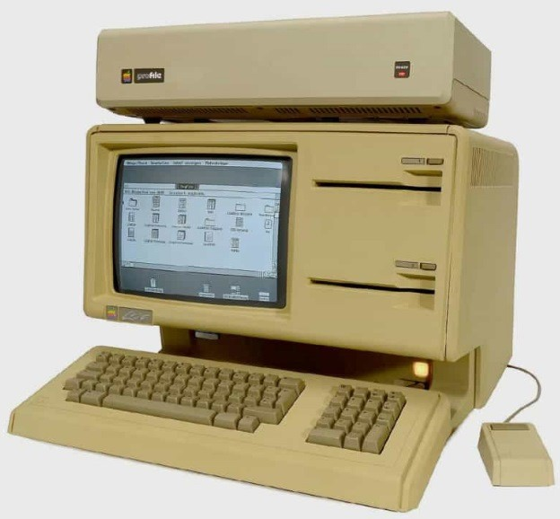
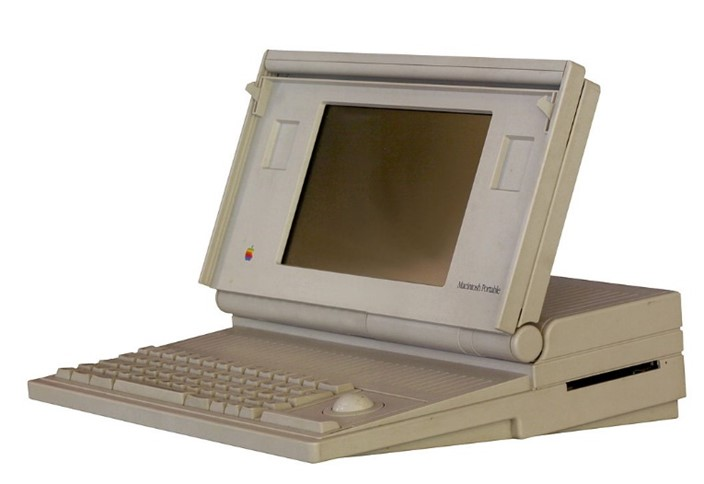
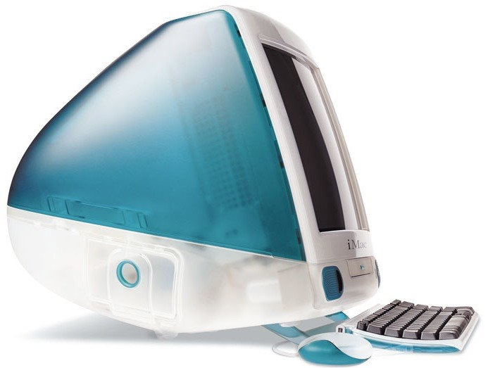
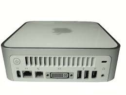
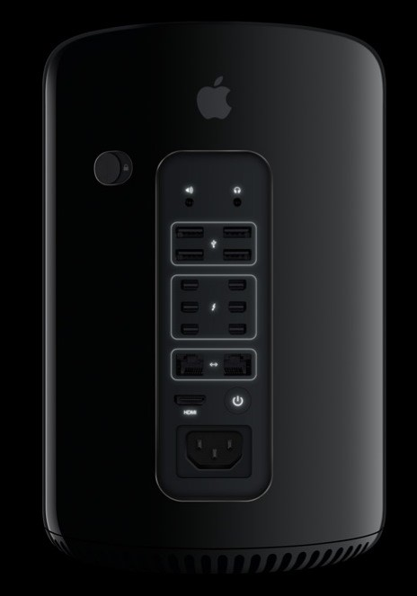

# Apple

A Apple, uma das maiores empresas do mundo, desenvolve produtos de alta tecnologia para o usuário final. Desde o início de sua atuação, ela foi responsável por várias revoluções na área de TI, sendo talvez a mais lembrada a introdução do smartphone no mercado mundial.

A seguir são apresentados os equipamentos desenvolvidos por ela ao longo de sua atuação no mercado.

