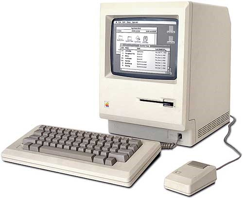
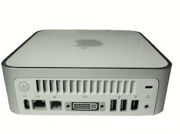

# Apple

A Apple, uma das maiores empresas do mundo, desenvolve produtos de alta tecnologia para o usuário final. Ela foi responsável por várias revoluções na área de TI sendo a introdução do smartphone no mercado mundial, talvez, a mais lembrada.

A seguir são apresentados os equipamentos desenvolvidos por ela ao longo de sua atuação no mercado.

## Década de 80

## Década de 90

## Primeira década do século XXI \(2000 ~ 2009\)

## Segunda década do século XXI \(2010 ~ 2019\)

## Terceira década do século XXI \(2020 ~ 2029\)

